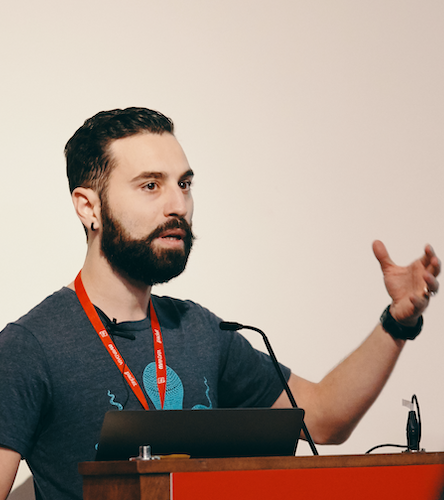
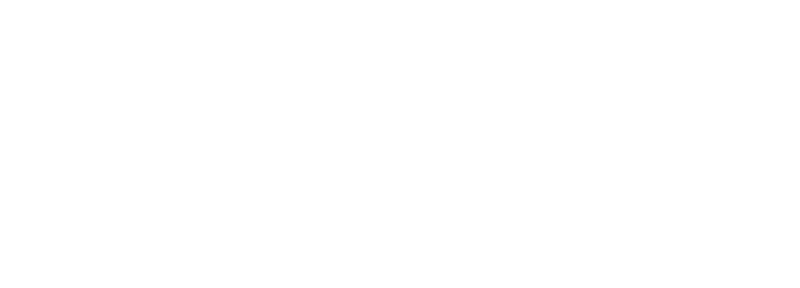
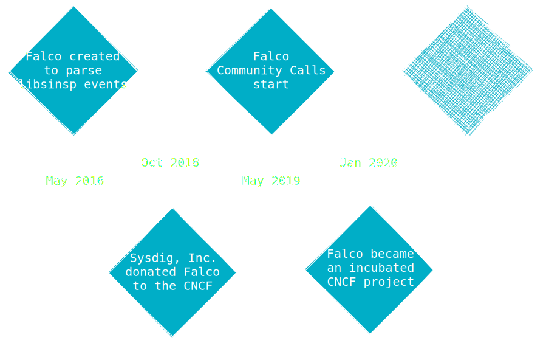

theme: Work, 1
autoscale: true
build-lists: true
slidenumbers: true
slidecount: true
slide-transition: fade(0.3)
footer: [@leodido](https://twitter.com/leodido)

# Bypass
# [fit] [Falco](https://github.com/falcosecurity/falco)

 

## Leonardo Di Donato - 20 Nov 2020

[.hide-footer: true]
[.slidenumbers: false]

---

# Whoami

 
## Leonardo Di Donato

## Open Source Software Engineer
## Falco Maintainer

 
## @leodido  

  

[.hide-footer: true]
[.slidenumbers: false]

---

## A timeline always works fine

