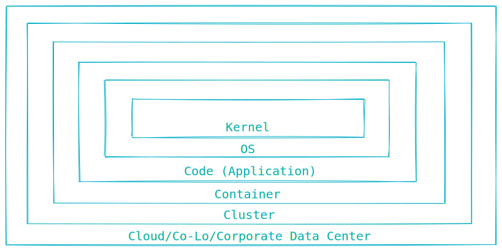

theme: Work, 1
autoscale: true
build-lists: true
slidenumbers: true
slidecount: true
slide-transition: fade(0.3)
footer: [@leodido](https://twitter.com/leodido)


# Bypass
# [fit] [Falco](https://github.com/falcosecurity/falco)


<br>

## Leonardo Di Donato - 20 Nov 2020

[.hide-footer: true]
[.slidenumbers: false]

---


# Whoami

<br>
## Leonardo Di Donato

## Open Source Software Engineer
## Falco Maintainer

<br>
## @leodido [](https://twitter.com/leodido) [](https://github.com/leodido)

  

[.hide-footer: true]
[.slidenumbers: false]

---

## A timeline always works fine


---


# Contents

* Rationale
* Falco
   * What's runtime security?
   * How does it work?
* Bypass!
   * /honk

[.hide-footer: true]
[.slidenumbers: false]

---


> You gonna get fired for this.
> It's a mistake.
-- my father.

---


> other quote
-- other author.

---

### Security

# [fit] Prevention + Detection

[.column]
Use **policies** to _change the behavior_ of a process by preventing syscalls from succeeding (also killing the process).

  

[.column]
Use **policies**  to _monitor the behavior_ of a process and notify when its behavior steps outside the policy.


[.autoscale: false]

---

# [fit] Prevention is not enough.
#### Combine with runtime detection tools. Use a [defense-in-depth](https://en.wikipedia.org/wiki/Defense_in_depth_(computing) :link: strategy.



---


# [fit] Runtime Security

She’s **Kelly**. :broken_heart:

I have a lock on my front door and an alarm. She alerts me when things aren’t going right, when little bro is misbehaving or if there’s someone suspicious outside or nearby.

She detects **runtime anomalies** in my life at home.

**Still...** Bad people were able to defy her and break into my house.

---

<br>
<br>
# [fit] There is no such thing
# [fit] as perfect security.

---

# ...

---

# ...

---

# Categories

---

# Override binaries


```yaml
rule: ...
```

---

## Demo

...

---

# Mitigation

---

# Missing renameat2

---

# Missing excecveat

---

# Mitigations

---


---

# ...

---


# [fit] Thanks and Honks!
### [fit] Does anyone have any questions?


[.column]
* [twitter.com/leodido](https://twitter.com/leodido)
* [gh:leodido](https://github.com/leodido)
* [gh:falcosecurity/falco](https://github.com/falcosecurity/falco)
* [slack.k8s.io](https://slack.k8s.io), #falco channel

[.column]


[.build-lists: false]
[.hide-footer: true]
[.slidenumbers: false]