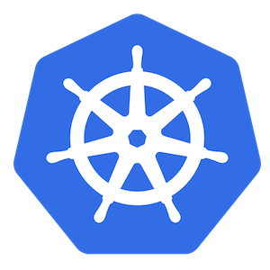
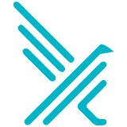
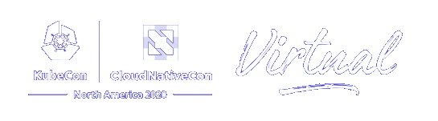

theme: Work, 1
autoscale: true
build-lists: true
slidenumbers: true
slidecount: true
slide-transition: fade(0.3)
footer: [@leodido](https://twitter.com/leodido)


# **Bypass**
# [fit] [Falco](https://github.com/falcosecurity/falco)


<br>

## **Leonardo Di Donato** - 20 Nov 2020

[.hide-footer: true]
[.slidenumbers: false]

^ Hello everybody!

^ Welcome to this cheeky new talk!

^ It can sound strange, but the goal of this talk is to share with you all the findings of an experiment: finding new ways to bypass a CNCF cool tool called Falco.

^ Falco is a runtime security project and, I should add, I’m one of its authors

---


# Whoami

<br>
## Leonardo Di Donato

## Open Source Software Engineer
## Falco Maintainer

<br>
## @leodido [](https://twitter.com/leodido) [](https://github.com/leodido)

  

[.hide-footer: true]
[.slidenumbers: false]

^ My name is Leonardo Di Donato, but people usually shorten my name.
So feel free to just call me Leo.

^ Here’s a photo of me moving hands like a real Italian.
Usual promise: Falco swag to the first one guessing the exact meaning and writing it to my Twitter direct messages!

^ What I do daily?

^ Well, I’m an Open Source Software Engineer at Sysdig where my daily job is to (guess what?) write code for Falco and maintain it.
As a maintainer of Falco, I also have to advocate and present its technologies and all the hard work we do to continuously improve it.

^ Maybe you’re confused at this point: “what, a maintainer of Falco talking on how to bypass it?”.

^ I know, crazy times to be alive!

^ I firmly believe that challenging your software really hard is the only way to actually improve it.

^ But just give me some minutes and I’ll completely explain to you the reasoning behind this approach.

^ In the meantime, you can find me on Twitter, where I tweeted these slides, with the nickname leodido.

^ Feel free to drop me a line! Follow me and ask questions about Falco, eBPF, kernel, whatever! No problem at all.

---

## A timeline always works fine


^ First things first. Where does Falco come from?

^ Falco is a runtime security project originally created in 2016 by Sysdig, the company that pays me a salary. I don't know why...
Then, in 2018 it was donated to the CNCF, a branch of the Linux Foundation, thus becoming the first CNCF sandboxed runtime security project.

^ It started to gain some serious traction, to the point that the other maintainers and I had even to start weekly community calls. To which by the way I invite anyone to participate every Wednesday at 5 PM Italian time!

^ This past January, Falco was the first-ever runtime security project to be promoted to the CNCF incubation-level.

^ The next natural step is to bring Falco to a level of maturity so as to make it possible to graduate it.

^ But in order to do this, it is absolutely essential that we identify and assess its faults.
It’s also with this in mind that I thought about this talk.
Stressing our software, challenging its limits, so to be able to improve them is the first step.
And I invite anyone here to try Falco, challenge it, and report back to us and to the Falco community the findings, so we can gain more and more awareness!

^ In the end, breaking things is the best way to understand how to fix them. Isn’t it?

---


# Contents

* Rationale
* Falco
   * What's runtime security?
   * How does it work?
* Bypass!
   * /honk

[.hide-footer: true]
[.slidenumbers: false]

^ Anyways, the plan for the next 20 minutes is to look at photos of my beautiful homeland in southern Italy, remembering the good old times when we were all free to travel around, and pandemics were a movie thing.

^ In the meanwhile, I’ll approach the reasons behind the choice to stress Falco. Why I think this is the best possible approach to make a runtime security software more and more solid, day after day.

^ In order to do so, we also need to briefly get the skinny on how Falco solves the runtime security problem, even for the cloud-native environments based on Kubernetes.
And the way to do this is by looking at how it actually works under the hoods.
I mean, that’s the way to go when you really want to understand things…
Not to mention when you want to bypass them!
We’ll also reflect on the security landscape in general.

^ Shortly after this speech, I’ll demo some of the possible ways to bypass of Falco I identified.  Developing them has accounted for most of the work that went into preparing this talk!
I’ll also present some mitigations and even fixes that we put in place to prevent you from using my ideas to bypass my beloved Falco in the future! Consider it an encouragement to find and develop your own.

---


> You gonna get fired for this.
> It's a mistake.
-- my father.

^ As soon as this talk got accepted I told my dad: “Look Pa, I’m gonna teach people how to bypass the software I build”.
I’ll spare you the details, but what ensued was a fairly predictable (and stereotypical) Italian family drama: he started yelling at me, and shouted that to do such a thing was a grave and unforgivable mistake. That Sysdig could have, nay - should have - fired me for even conceiving something as twisted as this.
Indeed, according to him, presenting in public the shortcomings of the software I contribute to creating amounted to admit some sort of failure, either mine or of my team or of my company as a whole. In his eyes, it was an admission of defeat, the product of a subversive attitude.

---


^ I tried - in vain, as he was still shouting - to explain that a constructive attitude begins with a quest for our weaknesses. It is the first, and necessary, step in gaining self-awareness. It is only by getting to REALLY know our limits that we can hope to overcome them. It is only after having looked into the ravines long enough that we can imagine ways of filling them. It’s a matter of epistemic hunger, of knowing that a path to real improvement is almost inevitably convoluted, difficult, painful.

^ Software development can be conceived as a process whose main feature is the continuous strive for the attainment of perfection that is, by definition, unattainable. The life of software is really over only when it is no longer fixed or improved. Any software will always present some glitches, but broken doesn’t mean unfixable. Software is improved over time and made more robust and reliable by this continuous process of tinkering, playing, fixing, improving.
This is the case in every subfield of computer science, but even more so in a realm as dynamic as security, in which every day carries the possibility that our solutions and protocols suddenly become obsolete, and in need of a fix, a patch, or generally an improvement.

^ When I think about, often Kitsugi pops into my mind.
Kintsugi is an ancient Japanese art, consisting of repairing broken pottery by mending the areas with powdered gold, silver, or platinum. It treats breakage and repair as part of the history of an object, rather than something to disguise.

^ In a very real sense, this Japanese practice - that fascinates me - captures the core of what I’ve said so far. Indeed, developing software is a therapeutic process that inscribes the way we deal with imperfections, glitches, fissures into the essence of our software, making it more precious and more solid as a result.

---

### Security

# [fit] Prevention + Detection

[.column]
Use **policies** to _change the behavior_ of a process by preventing syscalls from succeeding (also killing the process).

  

[.column]
Use **policies**  to _monitor the behavior_ of a process and notify when its behavior steps outside the policy.



[.autoscale: false]

^ But let’s come back to the real-world now.
So what does security mean to me? How to characterize the security problem?
I don’t know about you, but I personally wouldn’t want anything to happen to my systems without me noticing it!
At least in this context, I want to be able to determine what things can happen, and what cannot.
Since preemptive control is not always possible, I also want to possess deep visibility, so as to be able to know what just happened as soon as possible.
Basically, I think of security in terms of two words: prevention and detection.

^ What do these two words have in common? Policies.
Both concepts use some kind of policies to describe the allowed or disallowed behavior for a process, in terms of system calls, their arguments, and host resources accessed.

^ The main difference is this: the first word, prevention, is connected to the concept of enforcement. In other words, do not allow some actions to take place to happen at all, because of some policies.
Tools in this category - such as seccomp, seccomp-bpf, SELinux, AppArmor, or even authorization mechanisms like Kubernetes RBAC or the Kubernetes policy-based admission plugins - change the behavior of a process by preventing actions (or syscalls) from succeeding, or in some cases, also killing the process trying to perform those actions.

^ On the other hand, the second approach to security is to use the policy to monitor the behavior of a process, and notify when it steps outside the policy.

^ Falco belongs to this second group.
A topic that, especially in cloud-native security environments has not been solved yet.

^ Maybe you’re wondering now: can Falco solve all our security concerns?

---

# [fit] Prevention is **not** enough.
#### Combine with runtime detection tools. Use a [defense-in-depth](https://en.wikipedia.org/wiki/Defense_in_depth_(computing) :link: strategy.


^ Honestly, not at all!
Software is made of layers. So is security.

^ This is even more true in the current cloud-native environments, as you can see in the scheme on the slide. Pods, services, ingress, containers, and so on, up and down. These are environments that embrace change as their fundamental component, constantly opening the doors to the unknown.

^ So Falco exists to enable us to detect intrusions, malicious behaviors, security threats in general, at runtime.
Let me be also clear that, since security is made of layers, my suggestion is to combine it with prevention tools, thus applying a defense-in-depth strategy.

^ The idea is to defend a system against any particular attack using several independent methods.

^ The first specific example that comes to my mind is using Falco to identify malicious attempts to access sensitive resources by observing the whole behavior of your environments, and then write appropriate enforcement policies, for example, AppArmor profiles for your containers, etc. that will prevent the episode to happen again in the future.

^ Basically implementing a sort of feedback loop continuously improving the security posture of our environments.

---


# [fit] Runtime Security

She’s **Kelly**. :broken_heart:

I have a lock on my front door and an alarm. She alerts me when things aren’t going right, when little bro is misbehaving or if there’s someone suspicious outside or nearby.

She detects **runtime anomalies** in my life at home.

**Still...** Bad people were able to defy her and break into my house.

^ So, what’s runtime security?

^ With this term, I refer to the practice of using detection tooling to detect unwanted behavior, such that it can then be prevented using prevention techniques.
So to continuously improve your threat model.

^ It’s the last line of defense.

^ This means that in case it’s not able to promptly detect and alert you of malicious attempts you will end up like sitting ducks, defenseless.

^ Let’s try with a metaphor.

^ She’s Kelly. Look how beautiful she was...
I have locks on my door and also an alarm (think of them as compliance rules), but she alerts me when things aren’t going right (policy violations), when little bro is misbehaving (think of him like a compromised insider) or if there’s something suspicious happening outside or nearby (anomaly or zero-day).

^ She detects runtime anomalies in my life at home.
And she was - may she rest in peace - very serious about her job. As you can see in the picture.

^ So while prevention is about locking the doors, detection is about continuously monitoring the inside and the perimeter.

^ Still, bad people were able to enter my house and put her to sleep.

^ I think I made myself a bit more clear now...

---


<br>
<br>

# [fit] There is no such thing
# [fit] as perfect security.

^ In case you are still not convinced that there’s no such thing as a perfectly safe and perfectly secure software, and a layered approach is the best possible strategy for software security, just allow me to emphasize a few points.

^ How to trust cloud providers and their ability to detect malicious or compromised insiders? How to prevent an undisclosed vulnerability or a 0day bug that allows someone to break into your systems? I mean, CVE still happens... Linux, Kubernetes, name an open-source software that has not experienced a CVE and suffered an exploit.

^ Falco had one, too.

^ I think it’s clear now that prevention tools alone are not enough!
Neither are detection tools.

^ Good computer security is hard – it requires a lot of technical knowledge, and takes a lot of time and effort… And at the end of the day, there will always still be weaknesses in your system. This means that you should never be lulled into a false sense of security, thinking that you are working on a “secure” system. Your system can be more or less secure, but a perfect one doesn’t exist.

^ This doesn’t mean you should do nothing. It’s just about awareness.
And surely there are ways to harden your runtime.
For example, dropping capabilities - so preventing things to happen - when a container starts is a way to harden it, but that’s just on side of the coin.

---


# How **Falco** works?


^ When you have a goal of reinforcing the isolation between the container and the host towards using a container more like a “sandbox”, the main option you have is syscall monitoring.

^ At this point, somebody could still argue: but why tracing the syscalls?

^ Because, in the end, whatever program you run, it will end up making a lot of syscalls.
Syscalls are the way programs ask the Kernel, where everything really happens, to perform some task. Whether the task regards networking, IO, processes, and so on this does not matter.

^ Here Falco enters the game.

^ Falco is designed to leverage libsinsp events to add a layer of security on top of your containers and your nodes. Its approach for detecting security threats is to go at the lowest possible level and trace all the footprints and the context in which they happened.

^ The libsinsp events are a special augmented structure containing info obtained by tracing the syscalls going on in the kernel plus container runtime and Kubernetes metadata info related to those signals.

^ It uses those events to match a rule list that you can define with a simple yet expressive language, as we’ll see very soon.

^ At the moment, Falco can receive those events in three alternative ways, that we call “drivers”: through a kernel module, or with an eBPF probe, or with a ptrace-based driver called pdig that’s really helpful in environments where you cannot install the other two drivers just mentioned.

^ Anyway, Falco can also use other input sources, at the same time. I’m referring to the Kubernetes Audit logs in particular, that proven to be very useful when leveraged by Falco to improve the visibility into Kubernetes clusters.

---


# Falco rules are YAML![^1]

[.column]
* lists
* conditions
* macros
* priorities/severities
* (custom) output messages
* tags
* overrides
* exceptions (soon)

[.column]


[^1]: [default rulesets](https://github.com/falcosecurity/falco/tree/master/rules) 📋

^ I mentioned the Falco rules’ language, right?
So, maybe, you asking yourself: ok Leo but how do we define policies? How do we describe what is a security threat for us?

^ The Falco rules are very simple to write since they are basically... YAML!
And this makes them very easy to write, to learn, and very very hard to indent correctly (but that’s YAML fault, not ours).
Falco rules proven to be very straightforward to adopt, unlike the policy languages of the other tools in the security space we mentioned early.

^ I mean, have you ever tried writing SElinux policies and things like that?

^ In a Falco ruleset, you can write conditions, you can group them into macros to reuse them later. You can define lists. You can give names to rules, customize their output message, and the details it has to contain, and so on.

^ You can also override and mix things, totally or partially.

^ Finally, Falco ships with a default huge ruleset, for reasons we’re gonna understand better in a bit…

^ In case you want to jump into reading thousands of lines of YAML, I put a link in the slide footnote. You’re welcome!


---

# [fit] Detect attempts to spawn a shell from non-shell applications[^2]

[.column]
```yaml
- rule: Run shell untrusted
  desc: >
  An attempt to spawn a shell below a non-shell application.
  Specific applications are monitored.
  condition: >
    spawned_process
    and shell_procs
    and proc.pname exists
    and protected_shell_spawner
    and not proc.pname in (shell_binaries, gitlab_binaries,
        cron_binaries, user_known_shell_spawn_binaries,
        needrestart_binaries, mesos_shell_binaries,
        erl_child_setup, exechealthz, PM2,
        PassengerWatchd, c_rehash, svlogd,
        logrotate, hhvm, serf, lb-controller,
        nvidia-installe, runsv, statsite, erlexec,
        calico-node, "puma reactor")
    and not proc.cmdline in (known_shell_spawn_cmdlines)
    and not ...
    and not user_shell_container_exclusions
  output: >
    Shell spawned by untrusted binary
    (user=%user.name user_loginuid=%user.loginuid
    shell=%proc.name parent=%proc.pname cmdline=%proc.cmdline
    pcmdline=%proc.pcmdline gparent=%proc.aname[2] ggparent=%proc.aname[3]
    aname[4]=%proc.aname[4] aname[5]=%proc.aname[5]
    aname[6]=%proc.aname[6] aname[7]=%proc.aname[7]
    container_id=%container.id image=%container.image.repository)
  priority: DEBUG
  tags: [shell, mitre_execution]
```

[.column]
```yaml
- macro: spawned_process
  condition: evt.type = execve and evt.dir=<

- list: shell_binaries
  items: [ash, bash, csh, ksh, sh, tcsh, zsh, dash]

- macro: shell_procs
  condition: proc.name in (shell_binaries)

- list: protected_shell_spawning_binaries
  items: [
    http_server_binaries, db_server_binaries, nosql_server_binaries, mail_binaries,
    fluentd, flanneld, splunkd, consul, smbd, runsv, PM2
    ]

- macro: protected_shell_spawner
  condition: >
    (proc.aname in (protected_shell_spawning_binaries)
    or parent_java_running_zookeeper
    or ...
    or possibly_node_in_container)

- list: known_shell_spawn_cmdlines
  items: [
    '"sh -c uname -p 2> /dev/null"',
    '"sh -c uname -s 2>&1"',
    '"sh -c uname -r 2>&1"',
    '"sh -c uname -v 2>&1"',
    '"sh -c uname -a 2>&1"',
    '"sh -c ruby -v 2>&1"',
    ...
    '"sh -c /bin/sh -c ''date +%%s''"'
    ]
```

[^2]: [rule definition](https://github.com/falcosecurity/falco/blob/47fa7d53c43455540ae7ccbe4a1445a93511f723/rules/falco_rules.yaml#L1760) :link:

^ For example, here we have a rule to detect untrusted shell being spawned below a non-shell application.

^ By looking at its condition we can see that, aside from specific applications that are allowed to spawn shells, this rule emits an output alert in case:

^ - the macro “spawned\_process” evaluates to true, which means an “execve” syscall was detected, which in turn means a program has been executed
- the name of the current process is one in the “shell\_procs” list, so bash, dash, and so on...
- the current process has a parent one
- the name of the ancestor of the current process is one of those listed by the “protected\_shell\_spawning\_binaries” list

^ The first thing that catches my eye here is the “spawned\_process” macro that only checks for the “execve” event. This syscall is part of the "exec" family. It executes a program referred to by the pathname given to it as the first argument. But “execve” has siblings in this family…

^ Let’s see if we can circumvent this rule to trigger by using a brother or a sister of the “execve” syscall…

---


# execveat

## [demo](http://bit.ly/bypass-falco-execveat-kubecon)


^ Ready? Demo time!

^ VIDEO

---

# <rule detecting rename>

```yaml
rule: ...
```

---

# RENAMEAT2

### video

---

# [fit] Missing syscalls

### considerazioni
### PRs lore di fix
### breve how-to
### CALL-TO-ACTION

Do you mind start contributing to Falco and its drivers?
This is a wonderful opportunity honestly.
Join us and we'll do our best to ease your first contribution!

---


## [fit] Detect package management process ran inside container...

#### **Error** Package management process launched in container (**user**=root **user\_loginuid**=-1 **command**=apt update -y **container\_id**=6640634d89d4 **container\_name**=testdpkg **image**=ubuntu:18.04)

[.column]

```yaml
- macro: never_true
  condition: (evt.num=0)

- macro: spawned_process
  condition: evt.type = execve and evt.dir=<

- macro: container
  condition: (container.id != host)

- list: deb_binaries
  items: [
    dpkg, dpkg-preconfigu, dpkg-reconfigur, dpkg-divert, apt, apt-get, aptitude,
    frontend, preinst, add-apt-reposit, apt-auto-remova, apt-key,
    apt-listchanges, unattended-upgr, apt-add-reposit, apt-config, apt-cache
    ]

- list: package_mgmt_binaries
  items: [..., deb_binaries, alternatives, pip, pip3, apk, gem, snapd, ...]

- macro: package_mgmt_procs
  condition: proc.name in (package_mgmt_binaries)

- macro: package_mgmt_ancestor_procs
  condition: proc.pname in (package_mgmt_binaries) or
             proc.aname[2] in (package_mgmt_binaries) or
             proc.aname[3] in (package_mgmt_binaries) or
             proc.aname[4] in (package_mgmt_binaries)

- macro: user_known_package_manager_in_container
  condition: (never_true)
```

[.column]

```yaml
- rule: Launch Package Management Process in Container
  desc: Package management process ran inside container
  condition: >
    spawned_process
    and container
    and user.name != "_apt"
    and package_mgmt_procs
    and not package_mgmt_ancestor_procs
    and not user_known_package_manager_in_container
  output: >
    Package management process launched in container
    (user=%user.name user_loginuid=%user.loginuid command=%proc.cmdline
    container_id=%container.id container_name=%container.name
    image=%container.image.repository:%container.image.tag)
  priority: ERROR
  tags: [process, mitre_persistence]
```

---


# Let's do it again

## [demo](http://bit.ly/bypass-falco-packagemanager-in-container-kubecon)


^ Let's bypass a Falco rule again now! But differently this time...

^ VIDEO

---

# Mitigations

---


## Close the gate of the (Lua) outputs?

## [demo](http://bit.ly/bypass-falco-disabling-lua-outputs-kubecon)


^ This is the last little bypass demo, I promise!

^ VIDEO

---

### Solution?

# [fit] Remove Lua

We started by rewriting outputs gate in C++. (pr grasso)

We plan to also rewrite the parser and the engine completely. So stay in touch!

---


# [fit] Thanks and Honks!
### [fit] Does anyone have any questions?



[.column]
* [twitter.com/leodido](https://twitter.com/leodido)
* [gh:leodido](https://github.com/leodido)
* [gh:falcosecurity/falco](https://github.com/falcosecurity/falco)
* [slack.k8s.io](https://slack.k8s.io), #falco channel

[.column]


[.build-lists: false]
[.hide-footer: true]
[.slidenumbers: false]