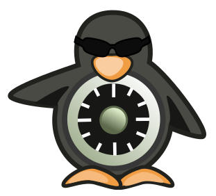

theme: Work, 1
autoscale: true
build-lists: true
slidenumbers: true
slidecount: true
slide-transition: fade(0.3)
footer: [@leodido](https://twitter.com/leodido)


# **Bypass**
# [fit] [Falco](https://github.com/falcosecurity/falco)


<br>

## **Leonardo Di Donato** - 20 Nov 2020

[.hide-footer: true]
[.slidenumbers: false]

^ Hello everybody!

^ Welcome to this cheeky new talk!

^ It can sound strange, but the goal of this talk is to share with you all the findings of an experiment:  finding new ways to bypass a CNCF cool tool called Falco.

^ Falco is a runtime security project and, I should add, I’m one of its authors

---


# Whoami

<br>
## Leonardo Di Donato

## Open Source Software Engineer
## Falco Maintainer

<br>
## @leodido [](https://twitter.com/leodido) [](https://github.com/leodido)

  

[.hide-footer: true]
[.slidenumbers: false]

---

## A timeline always works fine


---


# Contents

* Rationale
* Falco
   * What's runtime security?
   * How does it work?
* Bypass!
   * /honk

[.hide-footer: true]
[.slidenumbers: false]

---


> You gonna get fired for this.
> It's a mistake.
-- my father.

---


---

### Security

# [fit] Prevention + Detection

[.column]
Use **policies** to _change the behavior_ of a process by preventing syscalls from succeeding (also killing the process).

  

[.column]
Use **policies**  to _monitor the behavior_ of a process and notify when its behavior steps outside the policy.


[.autoscale: false]

---

# [fit] Prevention is not enough.
#### Combine with runtime detection tools. Use a [defense-in-depth](https://en.wikipedia.org/wiki/Defense_in_depth_(computing) :link: strategy.


---


# [fit] Runtime Security

She’s **Kelly**. :broken_heart:

I have a lock on my front door and an alarm. She alerts me when things aren’t going right, when little bro is misbehaving or if there’s someone suspicious outside or nearby.

She detects **runtime anomalies** in my life at home.

**Still...** Bad people were able to defy her and break into my house.

---


<br>
<br>
# [fit] There is no such thing
# [fit] as perfect security.

---


# How **Falco** works?


---


# Falco rules are YAML![^1]

[.column]
* lists
* conditions
* macros
* priorities/severities
* (custom) output messages
* tags
* overrides
* exceptions (soon)

[.column]


[^1]: [default rulesets](https://github.com/falcosecurity/falco/tree/master/rules) 📋


---

# [fit] Detect attempts to spawn a shell from non-shell applications[^2]

[.column]
```yaml
- rule: Run shell untrusted
  desc: >
  An attempt to spawn a shell below a non-shell application.
  Specific applications are monitored.
  condition: >
    spawned_process
    and shell_procs
    and proc.pname exists
    and protected_shell_spawner
    and not proc.pname in (shell_binaries, gitlab_binaries,
        cron_binaries, user_known_shell_spawn_binaries,
        needrestart_binaries, mesos_shell_binaries,
        erl_child_setup, exechealthz, PM2,
        PassengerWatchd, c_rehash, svlogd,
        logrotate, hhvm, serf, lb-controller,
        nvidia-installe, runsv, statsite, erlexec,
        calico-node, "puma reactor")
    and not proc.cmdline in (known_shell_spawn_cmdlines)
    and not ...
    and not user_shell_container_exclusions
  output: >
    Shell spawned by untrusted binary
    (user=%user.name user_loginuid=%user.loginuid
    shell=%proc.name parent=%proc.pname cmdline=%proc.cmdline
    pcmdline=%proc.pcmdline gparent=%proc.aname[2] ggparent=%proc.aname[3]
    aname[4]=%proc.aname[4] aname[5]=%proc.aname[5]
    aname[6]=%proc.aname[6] aname[7]=%proc.aname[7]
    container_id=%container.id image=%container.image.repository)
  priority: DEBUG
  tags: [shell, mitre_execution]
```

[.column]
```yaml
- macro: spawned_process
  condition: evt.type = execve and evt.dir=<

- list: shell_binaries
  items: [ash, bash, csh, ksh, sh, tcsh, zsh, dash]

- macro: shell_procs
  condition: proc.name in (shell_binaries)

- list: protected_shell_spawning_binaries
  items: [
    http_server_binaries, db_server_binaries, nosql_server_binaries, mail_binaries,
    fluentd, flanneld, splunkd, consul, smbd, runsv, PM2
    ]

- macro: protected_shell_spawner
  condition: >
    (proc.aname in (protected_shell_spawning_binaries)
    or parent_java_running_zookeeper
    or ...
    or possibly_node_in_container)

- list: known_shell_spawn_cmdlines
  items: [
    '"sh -c uname -p 2> /dev/null"',
    '"sh -c uname -s 2>&1"',
    '"sh -c uname -r 2>&1"',
    '"sh -c uname -v 2>&1"',
    '"sh -c uname -a 2>&1"',
    '"sh -c ruby -v 2>&1"',
    ...
    '"sh -c /bin/sh -c ''date +%%s''"'
    ]
```

[^2]: [rule definition](https://github.com/falcosecurity/falco/blob/47fa7d53c43455540ae7ccbe4a1445a93511f723/rules/falco_rules.yaml#L1760) :link:

---

# execveat

### video

---

# <rule detecting rename>

```yaml
rule: ...
```

---

# RENAMEAT2

### video

---

# [fit] Missing syscalls

### considerazioni
### PRs lore di fix
### breve how-to
### CALL-TO-ACTION

Do you mind start contributing to Falco and its drivers?
This is a wonderful opportunity honestly.
Join us and we'll do our best to ease your first contribution!

---


## [fit] Detect package management process ran inside container...

#### **Error** Package management process launched in container (**user**=root **user\_loginuid**=-1 **command**=apt update -y **container\_id**=6640634d89d4 **container\_name**=testdpkg **image**=ubuntu:18.04)

[.column]

```yaml
- macro: never_true
  condition: (evt.num=0)

- macro: spawned_process
  condition: evt.type = execve and evt.dir=<

- macro: container
  condition: (container.id != host)

- list: deb_binaries
  items: [
    dpkg, dpkg-preconfigu, dpkg-reconfigur, dpkg-divert, apt, apt-get, aptitude,
    frontend, preinst, add-apt-reposit, apt-auto-remova, apt-key,
    apt-listchanges, unattended-upgr, apt-add-reposit, apt-config, apt-cache
    ]

- list: package_mgmt_binaries
  items: [..., deb_binaries, alternatives, pip, pip3, apk, gem, snapd, ...]

- macro: package_mgmt_procs
  condition: proc.name in (package_mgmt_binaries)

- macro: package_mgmt_ancestor_procs
  condition: proc.pname in (package_mgmt_binaries) or
             proc.aname[2] in (package_mgmt_binaries) or
             proc.aname[3] in (package_mgmt_binaries) or
             proc.aname[4] in (package_mgmt_binaries)

- macro: user_known_package_manager_in_container
  condition: (never_true)
```

[.column]

```yaml
- rule: Launch Package Management Process in Container
  desc: Package management process ran inside container
  condition: >
    spawned_process
    and container
    and user.name != "_apt"
    and package_mgmt_procs
    and not package_mgmt_ancestor_procs
    and not user_known_package_manager_in_container
  output: >
    Package management process launched in container
    (user=%user.name user_loginuid=%user.loginuid command=%proc.cmdline
    container_id=%container.id container_name=%container.name
    image=%container.image.repository:%container.image.tag)
  priority: ERROR
  tags: [process, mitre_persistence]
```

---

## [fit] Let's do it again
## [fit] but in a different way

### video

---

# Mitigations

---

## [fit] Close the outputs gate

### video

---

### Solution?

# [fit] Remove Lua

We started by rewriting outputs gate in C++. (pr grasso)

We plan to also rewrite the parser and the engine completely. So stay in touch!

---


# [fit] Thanks and Honks!
### [fit] Does anyone have any questions?


[.column]
* [twitter.com/leodido](https://twitter.com/leodido)
* [gh:leodido](https://github.com/leodido)
* [gh:falcosecurity/falco](https://github.com/falcosecurity/falco)
* [slack.k8s.io](https://slack.k8s.io), #falco channel

[.column]


[.build-lists: false]
[.hide-footer: true]
[.slidenumbers: false]