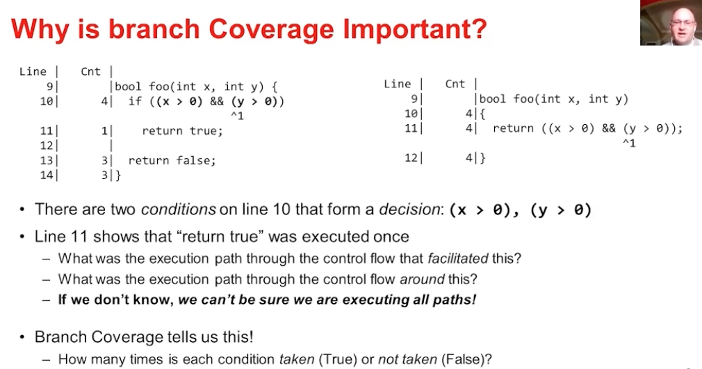
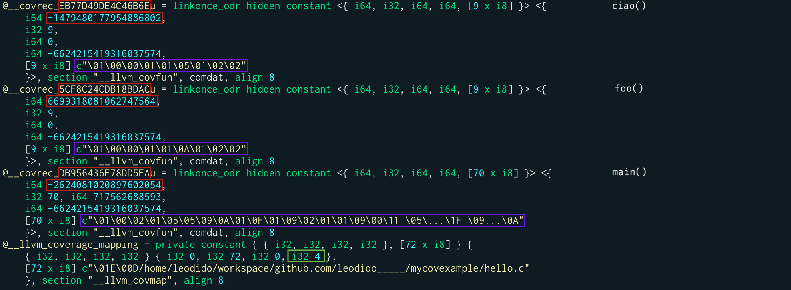

theme: Work, 1
autoscale: true
build-lists: true
slidenumbers: true
slidecount: true
slide-transition: fade(0.3)
footer: [@leodido](https://twitter.com/leodido)

## [fit] [bpfcov](https://github.com/elastic/bpfcov)

<br>

# [fit] **Coverage**
# [fit] for **eBPF** programs


<br>

## **Leonardo Di Donato** - 05 Feb 2022 @ [FOSDEM 22 - LLVM devroom](https://fosdem.org/2022/schedule/event/llvm_ebpf/)

[.hide-footer: true]
[.slidenumbers: false]

^ Hello everybody!

^ Today, I'm gonna present y'all a tool I've been working on during the past 2 months.

^ Its name is bpfcov.

^ And it's meant to let you obtain source-based code coverage of your eBPF applications actually running in the Linux kernel.

^ Clicking here on the title of the slide you can take a look at the source code of bpfcov on GitHub.

---


# whoami
<br>

### **Leonardo Di Donato**

### Open Source Software Engineer
### Falco Maintainer
### Senior eBPF Engineer @ Elastic Security

[](https://github.com/elastic/ebpf) [](https://github.com/falcosecurity/falco) 

## @**leodido** [](https://twitter.com/leodido) [](https://github.com/leodido)

[.hide-footer: true]
[.slidenumbers: false]

^ My name is Leonardo Di Donato, but people usually shorten my name.
So feel free to just call me Leo.

^ What do I love to do?

^ I love to mess with the Linux kernel, I love to fight with BPF VM in it, I love to build open-source tools, libraries. Things like Falco, the de-facto runtime security solution of the CNCF. You can find many of my projects around my GitHub.

^ I also love to share what I learn along the way, so here's why I came up with this talk!

^ In the meantime, you can find me on Twitter, where I tweeted these slides, with the handle leodido.

^ Feel free to follow me, drop me a line, ask questions about eBPF, kernel, Falco, security, whatever! No problem at all.

---


# [fit] why?

* Lot of **eBPF** for tracing and security applications out there
* Lot of **developers** approaching eBPF
* No simple way for them to get **coverage** for their **eBPF code running in the Linux kernel**
* **Test** eBPF programs via `BPF_PROG_TEST_RUN`, but not all program types are supported
* Which path my eBPF code took while running in the kernel? Which **code regions or branches** got evaluated and to what?
* General **lack of tooling** in the **eBPF ecosystem**

[.slidenumbers: false]

^ I bet we all have heard so much about eBPF in recent years.

^ Every day we wake up we hear about a new project or application using some eBPF black magic underneath.

^ Data shows how eBPF is fastly becoming the first choice for implementing tracing and security applications.

^ And in one simple twist of fate, a few months ago, I joined Elastic as a Senior eBPF Engineer. In fact, at Elastic we are writing a ton of eBPF programs (with a ton of developers) to supercharge our Security solution.

^ But the problem is that the eBPF ecosystem lacks tooling to make developers' life easier. There are no tools helping developers to clearly understand which path their code took while running in the Linux kernel. Which code regions or - better - code branches are uncovered, and maybe why.

^ I'm sure everyone here is already familiar with code coverage. It generally shows you which lines of code execute. Also, code coverage is usually applied to tests to discover which line gets run and which is not.

^ But even testing the eBPF programs is a pain, let me say it, given that `BPF_PROG_TEST_RUN` does not support all the types of eBPF programs living in the Linux kernel.

---

# Goal 🎯

Gather **source-based code coverage** for our **eBPF applications**.

eBPF is:

* usually written in C
* compiled via Clang to BPF ELF `.o` files
  * [LLVM BPF target](https://github.com/llvm/llvm-project/tree/main/llvm/lib/Target/BPF)
* loaded through the `bpf()` syscall
* executed by the eBPF Virtual Machine in the Linux kernel

^ That's why I sat down and wrote bpfcov: a tool to gather source-based coverage info for our eBPF programs running in the Linux kernel.
Whether they are getting loaded through `BPF_PROG_TEST_RUN` or by other ordinary means.

^ Until today, there was no simple way to visualize how the flow of your eBPF program running in the kernel was. Hopefully, there is one starting today.

^ eBPF is usually written in C. That code is then compiled to its specific instruction set thanks to Clang and the underlying LLVM BPF target which outputs a BPF ELF.

^ So, what makes it so different from other C programs? Couldn't we obtain coverage for eBPF programs just the way we do it for normal C programs?

^ Long story short, nope!

^ We can't mainly because the eBPF programs are verified, loaded, and executed in a constrained virtual machine in the Linux kernel that doesn't allow the common LLVM instrumentation needed for code coverage.

^ But, during this talk, I will show you the patches we need to apply to the LLVM IR of our eBPF programs to make it happen!

---

[.column]
# What's source-based coverage?

* Line-level granularity is not enough
* AST → regions, branches, ...
* Better to find grasps in the code


[.column]




[.build-lists: false]
[.hide-footer: true]
[.slidenumbers: false]

^ Line-level granularity is sometimes too coarse...

^ We do not want an approximation of what code actually executed.

^ Source-based code coverage is more precise. It has the notion of regions of the code, branches, and so on because it starts at abstract syntax tree time. It even precisely counts things like short-circuited conditionals, thanks to the counter expression and arithmetics.

^ It generates coverage summaries with very fined-grained code regions, helping us find grasps in the code.

^ If you wanna know more aobut how it's done and why it's so precise, I suggest you watch this talk by Alan Phipps.

---

# Source-based code coverage[^1] for C programs

[.column]
```c
#include <stdio.h>
#include <stdint.h>

void ciao()
{
    printf("ciao\n");
}

void foo()
{
    printf("foo\n");
}

int main(int argc, char **argv)
{
    if (argc > 1)
    {
        foo();
        for (int i = 0; i < 22; i++) {
            ciao();
        }
    }
    printf("main\n");
}
```

[.column]
```console
$ clang \
  -fprofile-instr-generate \
  -fcoverage-mapping \
  hello.c \
  -o hello


$ ./hello yay


$ llvm-profdata merge \
  -sparse default.profraw \
  -o hello.profdata


$ llvm-cov show \
  --show-line-counts-or-regions \
  --show-branches=count \
  --show-regions \
  -instr-profile=hello.profdata \
  hello
```

[^1]: for more details visit the [LLVM docs](https://clang.llvm.org/docs/SourceBasedCodeCoverage.html)

[.hide-footer: true]
[.slidenumbers: false]

^ To explain to you how I did bpfcov, I'll try to go over the steps I did to understand what source-based code coverage is, and how LLVM implements it.

^ I started from a dummy C program.

^ So, let's start with it to get an overview of the steps commonly needed to obtain source-based code coverage.

^ First, compile this simple C code with Clang adding the `-fprofile-instr-generate` and `-fcoverage-mapping` flags

^ Now, just execute your binary

^ When the process exits, the runtime instrumented in the binary by the previous flags outputs a profraw file

^ At this point, all is left to you to do is use LLVM's existing coverage tools (llvm-profdata and llvm-cov) to generate coverage summaries with very fined-grained code regions

---

# [fit] Source-based coverage


- **Efficient** and **accurate**
- Works with the existing LLVM coverage tools
- Highlights **exact regions** of code (**line:col** to **line:col**) that were skipped or executed
- Counts how many times a condition (**branches**) was taken or not (see lines 16 and 23)
- Tells us what was the **execution path** through the code

[.hide-footer: true]
[.slidenumbers: false]

^ And this is the awesome result we get! You may notice it is very accurate.

^ Looking at it we instantly know that the `if` conditional evaluated to true, and that the `for` cycle inside it iterated 22 times.

^ This kind of code coverage accounts for the finest details, telling us even what was the execution path through the code...

^ This dummy example can't show it but source-based code coverage unveils also things like short-circuited conditionals, expanses macros, and more.

^ This is definitely what I wanted for eBPF programs too!

---

# -fprofile-instr-generate

### Instruments the program functions to collect execution counts


^ So, let's see what the `-fprofile-instr-generate` actually does:
- it creates one `__profc_*` global array per function
  - the size of the array is the number of the counters for that function, see the yellow boxes
  - in fact, we can see that it created a total of 3 `__profc_*` global variables, one for each function we have there
  - you may also have noticed that `__profc_main` has 3 counters, one for each region of the `main` function:
    - the entry of the function, the `if` body, and the `for` body
- such a flag also creates one `__profd_*` global variable for each function
  - these are structs containing various info, like an ID (the ones in red boxes), a reference to the corresponding `__profc_*` array, the address of the instrumented function (and more), which are later used by LLVM to bind the encoded coverage info to the counters
- furthermore, it also creates a private constant `__llvm_prf_nm` containing the names of the functions that are being instrumented

---


^ Finally, such a flag, also patches the instructions of every function.

^ Look, these are the functions' instructions in LLVM intermediate representation...

^ As you can see in orange, it increments the counters in the right spots, letting LLVM take care of the global state of the registers

^ Notice that this flag also defines global functions like `__llvm_profile_init` and others...

^ Their goal is to initialize the profile at runtime and flush it out at the exit of the process in a profraw file.

^ Among the other things, we will need to strip these functions to have valid eBPF ELF files that we can load in the BPF VM in the Linux kernel... We'll see later.

---

# -fcoverage-mapping
## Generate coverage mappings



^ Now, the `-fcoverage-mapping flag.

^ First of all, let me say that this flag does not apply any patch to the program instructions!

^ But it creates one `__covrec_*` global constants for each function in your program

^ They encode the coverage regions, branches, and so on

^ Those are structs that - among other things - most notably contain:
- a LEB128 string, encoding various info about the coverage regions (the ones in purple)
- the ID of the function, the one annotated with a red rectangle
  - it is the same ID contained by `__profd_*` variables, do you remember?
  - its hex representation is also in the name of the `__covrec_*` variable

^ It also creates the `__llvm_coverage_mapping` constant, a struct made of two parts:
- the header, that contains things like the coverage mapping format version (see the green box)
- and the data, which contains the file names of the source files

^ If you wanna know all the details, I've put some links at the end of this deck. Now, it's time to move on...

---

# Demystifying the profraw format

1. header
2. data (`__profd_*` variables)
3. counters (`__profc_*` variables)
4. names (`__llvm_prf_nm` constant)

[.build-lists: false]

^ We've seen that when the `hello` binary exits, a `default.profraw` file is created

^ This happens because LLVM injected a runtime that detects the process dying and when it does happen, it outputs such a file

^ We can't do this for eBPF programs, because they are not userspace processes, so we're gonna figure out something...

^ It is necessary to take a look at what the profraw files contain because they are paramount for the success of bpfcov

^ Other than making us able to output something already supported by the LLVM existing coverage tools, it will give us a sense of what we need to support in the BPF ELF for giving coverage support to eBPF programs

^ So, the profraw format is made of 4 parts: a header, and then the data, the counters, and the names part

^ Good!

---

# [fit] Demystifying the profraw header

[.column]


[.column]
| | |
| :------------------------: | :---------------------------------- |
| magic                      | `__llvm_coverage_mapping[0][3]` + 1 |
| size of `__llvm_prf_cnts`  | padding before counters             |
| size of `__llvm_prf_data`  | padding after counters              |
| size of `__llvm_prf_names` | counters delta                      |
| names begin                | value kind last                     |

^ But what the header is made of?

^ The header is 80 bytes containing things like:
- the magic number
- the format version, obtained from the `__llvm_coverage_mapping`
- the size of the `__llvm_prf_data` section, which contains all the `__profd_*` variables
- the size of the `__llvm_prf_cnts` sections, which contains all the `__profc_*` variables
- the size of the `__llvm_prf_names` section, which contains the `__llvm_prf_nm` variable

^ We need to figure out a way to keep these sections, and these variables, in the intermediate representation of our eBPF programs.

^ At the same time, we need to ensure that the resulting BPF ELF will continue being valid and loadable by the BPF VM in the Linux kernel.

---

# [fit] Demystifying the profraw data part


^ The data part of the `profraw` file, as you would probably expect, is just the `__llvm_prf_data` section, nothing more.

^ In fact, the boxes in orange here in the screenshot, are the 3 `__profd_*` variables of our dummy C example.

^ For sure, also for eBPF, we're gonna need the ID (index 1) of each of them, the function control flow hash (index 2), and the number of counters the function has (index 6).

^ The address of the counters (index 3) and the address of the function (index 4) will require special attention. We can't have them. Also because we do not want to expose kernel addresses... Right?

---

# [fit] Demystifying the profraw counters part


^ Anyways, also the counters part is just a serialization of the `__llvm_prf_cnts` section's content.

^ Here in the image, you may notice we have 5 blue contiguous slots of 8 bytes each.

^ Because we had 1 counter for the `ciao` function, 1 also for the `foo` function, and 3 counters for the `main` function of our example.

^ Each of them contains, in hex, the value of the counter. For example, the first 16 value means that the `ciao` function was executed 22 times. While, the last 16 value means that the last counter of `main`, the one for the `for` cycle`, executed 22 times too!

^ If you come back to the previous slide containing the screenshot of the coverage for our dummy example, you'll see those are the values in there!

^ This is so cool!

---

# [fit] Demystifying the profraw names part


^ Finally, the names part of the `profraw` file.

^ There isn't much to say about this. It's just the serialization `__llvm_prf_names` section, that contains always and only one variable.

^ The only important thing to notice is the last null byte, the one circled in gray. It's because the `profraw` data needs to be page-aligned so some padding is needed.

---

# [fit] Patching LLVM IR for eBPF coverage
### How I did it

[.column]
```c
// SPDX-License-Identifier: GPL-2.0-only
#include "vmlinux.h"
#include <asm/unistd.h>
#include <bpf/bpf_helpers.h>
#include <bpf/bpf_core_read.h>
#include <bpf/bpf_tracing.h>

char LICENSE[] SEC("license") = "GPL";

const volatile int count = 0;

SEC("raw_tp/sys_enter")
int BPF_PROG(hook_sys_enter)
{
  bpf_printk("ciao0");

  struct trace_event_raw_sys_enter *x = (struct trace_event_raw_sys_enter *)ctx;
  if (x->id != __NR_connect)
  {
    return 0;
  }

  for (int i = 1; i < count; i++)
  {
    bpf_printk("ciao%d", i);
  }

  return 0;
}
```

[.column]
```c
// SPDX-License-Identifier: GPL-2.0-only
#include <asm/unistd.h>
#include <bpf/bpf.h>
#include "commons.c"
#include "raw_enter.skel.h"

...

int main(int argc, char **argv)
{
    struct raw_enter *skel;
    int err;

    ...

    /* Open load and verify BPF application */
    skel = raw_enter__open();
    if (!skel) ...

    // Set the counter
    skel->rodata->count = 10;

    err = raw_enter__load(skel);
    if (err) ...

    struct trace_event_raw_sys_enter ctx = {.id = __NR_connect};

    struct bpf_prog_test_run_attr tattr = {
        .prog_fd = bpf_program__fd(skel->progs.hook_sys_enter),
        .ctx_in = &ctx,
        .ctx_size_in = sizeof(ctx)
    };
    err = bpf_prog_test_run_xattr(&tattr);
cleanup:
    raw_enter__destroy(skel);
    return -err;
}
```

^ We should now have a better understanding of what it is the plan to have source-based coverage also for eBPF programs, right?

^ So, assuming we want coverage for this eBPF program on the left, we expect LLVM to instrument it with 2 `__profc_*` global variables, one for the `BPF_PROG` macro with just 1 counter, and another for the `hook_sys_enter` function with 3 total counters.

^ 3 counters for this function because one is to count the number of times this BPF function executes, one is for counting the `if` conditional, and finally the last one accounts for the `for` cycle executions.

^ So, we also expect 2 `__profd_*` global variables in the `__llvm_prf_data` section, the `__llvm_prf_nm` constant in the `__llvm_prf_names` section, the `__covrec_*` constants, the `__llvm_coverage_mapping` constant in the `__llvm_covmap` section

^ Good! But if you compile this BPF program on the left with the `-fprofile-instr-generate` and `-fcoverage-mapping` Clang flags and you then try to load it, you'll get a serious bunch of errors. Why's that?

---

# LLVM pass
### How I did it


1. Strip the LLVM runtime profile initialization functions/ctors
2. Ensure the eBPF program is compiled with debug info
3. Fixup visibility/linkage for **eBPF globals**
4. Create **custom eBPF sections**
   * `__llvm_covmap` → `.rodata.covmap`
   * `__llvm_prf_cnts` → `.data.profc`
   * `__llvm_prf_data` → `.rodata.profd`
   * `__llvm_prf_names` → `.rodata.profn`
5. Remove the `__covrec_*` constant structs
   * Keep them only in the BPF ELF for `llvm-cov`
   * Not in the BPF ELF for loading
6. Convert the `__llvm_coverage_mapping` struct to:
   * 2 different global arrays (header + data)
7. Convert any `__profd_*` struct to:
   * 7 different global constants (ID, hash, ..., # counters, ...)
8. Annotate with the **debug info** all the global variables and constants
9. Keep the `llvm.used` in sync

[.build-lists: false]

^ For various reasons.

^ First of all, libbpf supports (on recent Linux kernels) eBPF global variables, which - to simplify - are just eBPF maps with one single value, but it does not accept or recognize the ELF sections that the Clang instrumentation injects in the intermediate representation

^ So we need an LLVM pass that changes them to custom eBPF sections

^ The eBPF custom sections are in the form of `.rodata.` something or `.data.` something. They're made to contain static and/or global data.

^ We also need to strip any global constructor of function that LLVM instrumented for the profiling runtime, or the BPF virtual machine will refuse to load our BPF ELF

^ We also want to ensure that the eBPF program has been compiled with debug info, for relocation matters

^ At the same time, we also need to annotate with debug info all the global variables and constants we are keeping or creating in the BPF LLVM intermediate representation

^ For globals which are structs, since we want to keep things simple, we just transform them into different and single global variables, one for each field. For example, this is what I did for the `__profd_*` variables which originally are a struct with 7 fields.

^ In the case of the `__covrec_*` variables, I just strip them from the BPF ELF that is meant to be loaded in the kernel. I keep them in the other BPF ELF, the one that is intended to be given to `llvm-cov`. This is the reason we'll execute this LLVM pass two times with `opt`, one time with the `strip-initializers-only` flag.

^ So, this is roughly the plan that I came up with, and that I implemented!

---

[.column]
# **libBPFCov.so**
### How I did it


^ The image in this slides highlights everything we've just said so that you can use it as a reference in the future.

^ It shows the output intermediate representation after running the `bpfcov` LLVM pass on a coverage instrumented eBPF program.

---

# [fit] ./**bpfcov** run ...
### How I did it

1. `bpfcov run` - _run the instrumented eBPF application_
   1. Detect the **eBPF globals** (`__profc_*`, `__profd_*`, ...)
   2. Detect their **custom eBPF sections**
      * `.data.profc`
      * `.rodata.profd`,
      * `.rodata.profn`
      * `.rodata.covmap`
   3. Pin them to the **BPF FS**

[.build-lists: false]

^ Once you instrumented your eBPF application running `opt` with the `libBPFCov.so` pass on its LLVM intermediate representation, you have to use the bpfcov CLI tool, executing it with the `run` subcommand.

^ This command acts similar to `strace`. Basically, via the `bpfcov run` command you can run your eBPF application that loads your eBPF ELF.

^ While doing so, it will detect the `bpf()` syscall with the `BPF_MAP_CREATE` command.

^ Meaning that it will catch the eBPF globals in the `.profc`, `.profd`, `.profn`, and `.covmap` custom eBPF sections and pin them to the BPF FS.

^ Since we can't easily attach to the end or exit of an eBPF application, having the counters and all the other data we need in pinned eBPF maps will make us able to generate the `profraw` file manually when the eBPF application is completed, or when we explicitly stopped it.

---

# [fit] ./**bpfcov** gen|out ...
### How I did it

1. `bpfcov gen` - _generate the `profraw` from eBPF pinned maps_
   1. Read the content of the **pinned eBPF maps** at:
      * `/sys/fs/bpf/cov/<program>/{profc,profd,profn,covmap}`
   1. Dump it to to a valid **profraw** file
3. `bpfcov out` - _output coverage reports_
   1. Generates **profdata** files from `profraw` files
   2. Merges them into a single one
   3. **HTML**, **JSON**, **LCOV** coverage reports

[.build-lists: false]

^ This is why I created the `bpfcov gen` command exists. To dump the pinned maps in a `profraw` file.

^ Once we executed it and we finally have the `profraw` file we can either use the existing LLVM tools (`llvm-profdata` and `llvm-cov`) or simply use the `cov` subcommand, which is an opinionated shortcut to generate HTML, JSON, or LCOV coverage reports even from multiple eBPF programs and their `profraw` files.

---

# Usage

[.column]
#### **Compilation**
```bash
clang -g -O2 \
  -target bpf \
  -D__TARGET_ARCH_x86 \
  -I$(YOUR_INCLUDES) \
  -fprofile-instr-generate \
  -fcoverage-mapping \
  -emit-llvm -S \
  -c program.bpf.c \
  -o program.bpf.ll

opt -load-pass-plugin $(BUILD_DIR)/lib/libBPFCov.so \
  -passes="bpf-cov" \
  -S program.bpf.ll \
  -o program.bpf.cov.ll

llc -march=bpf -filetype=obj \
  -o cov/program.bpf.o \
  program.bpf.cov.ll

opt -load $(BUILD_DIR)/lib/libBPFCov.so \
  -strip-initializers-only -bpf-cov \
  program.bpf.ll | \
  llc -march=bpf -filetype=obj \
    -o cov/program.bpf.obj
```

[.column]
#### **Execution**
```bash
sudo ./bpfcov run cov/program
# Wait for it to exit
# Or stop it with CTRL+C

sudo ./bpfcov gen --unpin cov/program

./bpfcov out \
  -o awsm_report \
  --format=html cov/program.profraw
```

^ In this slide, I wrote down the manual steps you would need to instrument your eBPF application for code coverage. Basically, the ones we're gonna run in a second!

^ Please notice these steps, especially the ones on the left, are automated in the examples Makefile you can find in the GitHub repository.

---

# [fit] **Demo**

Who wanna read LLVM IR for eBPF with me? 😎

^ Who wanna read LLVM IR for eBPF with me? 😎

^ Let's see all I described in action!

---


[.hide-footer: true]
[.slidenumbers: false]

^ So to obtain wonderful coverage reports for our eBPF programs like those here in this slide!

---

# Resources

- Blog post: [Coverage for eBPF programs]()
- [Writing an LLVM pass](https://llvm.org/docs/WritingAnLLVMPass.html)
- The [Coverage Mapping](https://llvm.org/docs/CoverageMappingFormat.html) format
- [Dissecting the coverage mapping sample](https://llvm.org/docs/CoverageMappingFormat.html#dissecting-the-sample)
- The encoding of the coverage mapping values: [LEB128](https://en.wikipedia.org/wiki/LEB128)
- [Demystifying the profraw format](https://leodido.com/demystifying-profraw-format)
- The functions writing the `profraw` file: [lprofWriteData()](https://github.com/llvm/llvm-project/blob/e356027016c6365b3d8924f54c33e2c63d931492/compiler-rt/lib/profile/InstrProfilingWriter.c#L241), [lprofWriteDataImpl()](https://github.com/llvm/llvm-project/blob/e356027016c6365b3d8924f54c33e2c63d931492/compiler-rt/lib/profile/InstrProfilingWriter.c#L257)
- Source code (LLVM) emitting `__covrec_*` constants: [CodeGen/CoverageMappingGen.cpp](https://github.com/llvm/llvm-project/blob/d0ac215dd5496a44ce8a6660378ea40a6e1c148d/clang/lib/CodeGen/CoverageMappingGen.cpp#L1589)
- Calls to `CoverageMappingModuleGen` in LLVM: [CodeGenAction::CreateASTConsumer](https://github.com/llvm/llvm-project/blob/063c2f89aa7f5b0b61a63d639d8124035f26935c/clang/lib/CodeGen/CodeGenAction.cpp#L1016), [CodeGenModule::CodeGenModule](https://github.com/llvm/llvm-project/blob/de34a940ae72dfa6425a025538484f9505ca1d42/clang/lib/CodeGen/CodeGenModule.cpp#L183)
- Kernel patch: [eBPF support for global data](https://patchwork.ozlabs.org/project/netdev/cover/20190409212018.32423-1-daniel@iogearbox.net/)
- Kernel patch: [libbpf: support global data/bss/rodata sections](https://patchwork.ozlabs.org/project/netdev/patch/b73889608508d98bbd4d58af032528626a4950b0.1554731339.git.daniel@iogearbox.net/)
- [libbpf: arbitrarly named .rodata.* and .data.* ELF sections](https://github.com/libbpf/libbpf/blob/be89b28f96be426e30a2b0c5312d13b30ee518c7/src/libbpf.c#L1498-L1516)
- [LLVM BPF target source](https://github.com/llvm/llvm-project/tree/main/llvm/lib/Target/BPF)
- [How LLVM processes BPF globals](https://github.com/llvm/llvm-project/blob/ff85dcb1c5b01411a6f9f2dc4c0e087467411f50/llvm/lib/Target/BPF/BTFDebug.cpp#L1276)
- [Branch Coverage: Squeezing more out of LLVM Source-based Code Coverage](https://www.youtube.com/watch?app=desktop&v=H1hvtJPGWNQ) by Alan Phipps

^ Here there are some resources I believe you may find useful to go even deeper into this topic
^ Enjoy them!

[.build-lists: false]

---


# [fit] Thank you!
### Questions?


[.column]
* [twitter.com/leodido](https://twitter.com/leodido)
* [github.com/leodido](https://github.com/leodido)
* [github.com/elastic/bpfcov](https://github.com/elastic/bpfcov)

[.column]


^ We made it to the end!

^ Thanks everyone for being here and to bear with me!

^ I hope you enjoyed my approach to understanding, patching, and using the LLVM powers to give coverage reports to the eBPF community!

^ See you soon, let’s hope in person!

^ In the meantime, follow me on Twitter, and let’s keep in touch!

[.build-lists: false]
[.hide-footer: true]
[.slidenumbers: false]